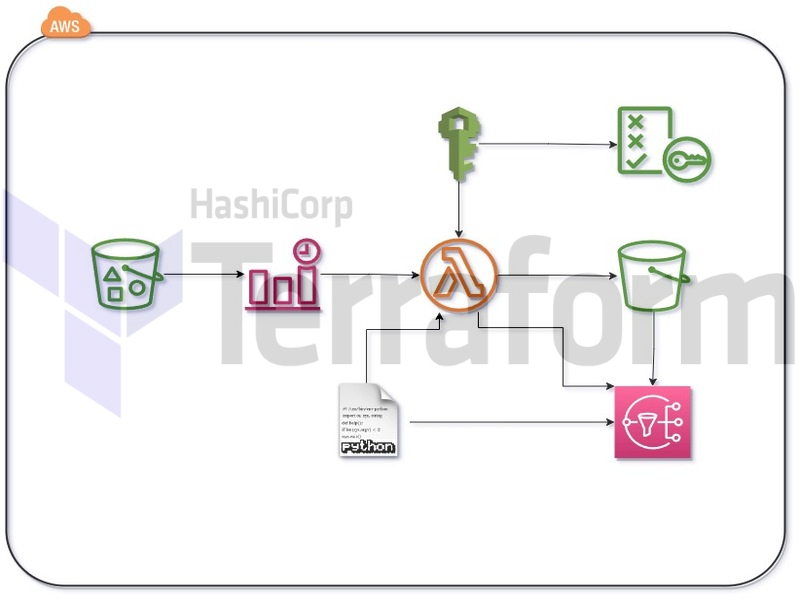
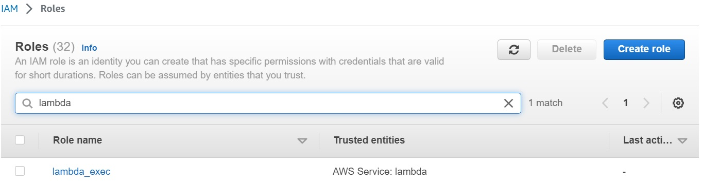
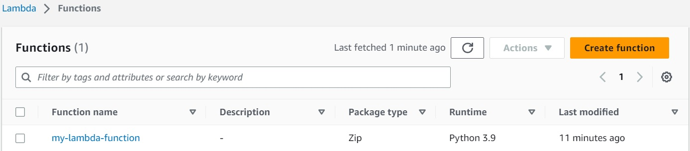
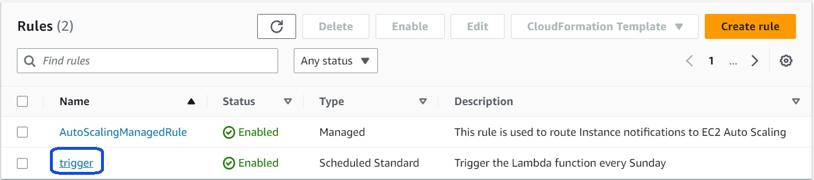
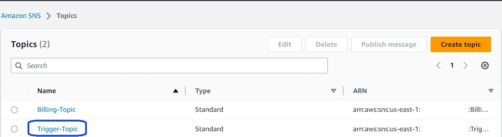

# Project-02: Automating AWS Infrastructure with Terraform: Creating an S3 Bucket, Lambda Function, and Trigger with CloudWatch Events

## Description

This Terraform code creates an S3 bucket, an AWS Lambda function, and triggers the Lambda function every Sunday using a CloudWatch Event rule using AWS services. Additionally, the Lambda function is created with an IAM role and associated permissions, and an IAM policy attachment is made for accessing the S3 bucket. Finally, the Terraform outputs display the identities of the created resources.

## Problem Statement

A vendor needs to upload a file to an S3 bucket every day for reporting purposes. We want to make sure this bucket is emptied out on a weekly basis on Sundays in order to keep costs down. Please create an S3 bucket and Lambda function using Terraform and any other services you deem required to complete this task. This process must be 100% automated and the Lambda function must be created using the latest version of Python. We also would like the Python script to detect if there are any lingering files left over in the S3 bucket after being emptied and alert members of the DevOps team if any are found. You will Terraform the creation of AWS resources to help solve this problem. You will also be expected to provide an output file as well as a tfvars file. We expect all modules and resources created to use variables as that is best practice in Terraform.

## Problem Solution

## main.tf:

This is the Terraform configuration file where we define the AWS resources that we want to create.

- First, we set the AWS provider configuration with the region specified in the var.region variable.
- Then, we create an S3 bucket using the aws_s3_bucket resource. We set the name of the bucket to the value of the var.bucket_name variable.

- We create an IAM role using the aws_iam_role resource. This role will be used by our Lambda function. We also attach a policy to this role using the aws_iam_role_policy_attachment resource.This policy grants permissions to our Lambda function to access the S3 bucket and CloudWatch resources.

- We create a Lambda function using the aws_lambda_function resource. We specify the function name, role, handler, runtime, and filename. We also set an environment variable called BUCKET_NAME to the value of the S3 bucket ID. This environment variable will be used by our Lambda function to get the S3 bucket name dynamically.

- We create a CloudWatch Event Rule using the aws_cloudwatch_event_rule resource. This rule will trigger our Lambda function based on a schedule expression.

- We create a Lambda Permission using the aws_lambda_permission resource. This permission allows CloudWatch Events to invoke our Lambda function.

- We create an SNS policy using the aws_iam_policy resource. This policy grants permissions to our Lambda function to publish messages to an SNS topic.

- Finally, we create a CloudWatch Event Target using the aws_cloudwatch_event_target resource. This target links the CloudWatch Event Rule to our Lambda function.

## variables.tf:

This file contains the variables used in our Terraform configuration.

lambda_function.py:

This is the Python code that our Lambda function will execute. The lambda_handler function is the entry point for the Lambda function. It uses the boto3 Python library to interact with AWS services. In this case, it gets the S3 bucket name from the BUCKET_NAME environment variable and deletes all objects in the bucket. Then, it checks if there are any lingering files in the bucket. If there are, it sends an SNS notification to a specified topic. If there aren't any lingering files, it sends a message saying that no lingering files were found.

## outputs.tf:

This file contains the outputs of our Terraform configuration. These outputs can be used by other Terraform configurations or scripts. In this case, we output the S3 bucket ID, Lambda function name, Lambda function ARN, and CloudWatch Event Rule ARN.

## Resources

- [Terraform Resource: aws_s3_bucket](https://registry.terraform.io/providers/hashicorp/aws/latest/docs/resources/s3_bucket)
- [Terraform Resource: aws_iam_role](https://registry.terraform.io/providers/hashicorp/aws/latest/docs/resources/iam_role)
- [Terraform Resource: aws_iam_policy](https://registry.terraform.io/providers/hashicorp/aws/latest/docs/resources/iam_policy)
- [Terraform Resource: aws_lambda_function](https://registry.terraform.io/providers/hashicorp/aws/latest/docs/resources/lambda_function)
- [Terraform Resource: aws_cloudwatch_event_rule](https://registry.terraform.io/providers/hashicorp/aws/latest/docs/resources/cloudwatch_event_rule)
- [Terraform Resource: aws_sns_topic](https://registry.terraform.io/providers/hashicorp/aws/latest/docs/resources/sns_topic)

## Contact

- Please contact me to access the project files.
    * yasinkaya.devops@gmail.com